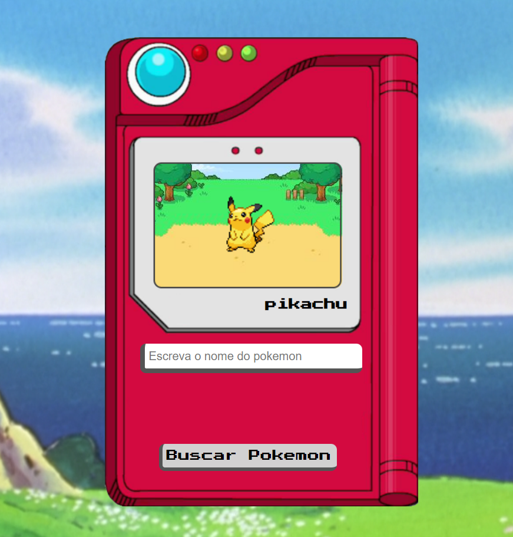

## Pokédex
Neste projeto utilizei meus primeiros conhecimentos sobre requisição http. Ele foi o "hello, world!" para novos horizontes no meu mundo da programação.

## Tecnologias
>
Aqui está as tecnologias usadas no projeto

 - ReactJS 18.2.0
 - Node-sass 7.0.1 
 - Axios 0.27.2
 
 ## Serviços usados
  - Netlify
  - Fithub

## Como usar

### 1 - Tela inicial
  

### 2 - Buscar o pokemon
  
  

### 3 - Em caso de erro
   

## Funcionalidades

A principal funcionalidade é:
 - Requisição http no API pokeapi.co

## Links
 - Repositório: https://github.com/Vinicius-B-Leite/pokede
 - deploy: https://pokedex-vbl.netlify.app/	
 - Em casos de bugs, por favor me contate
  viniciusbleite21@gmail.com

## Versão
 1.0.0